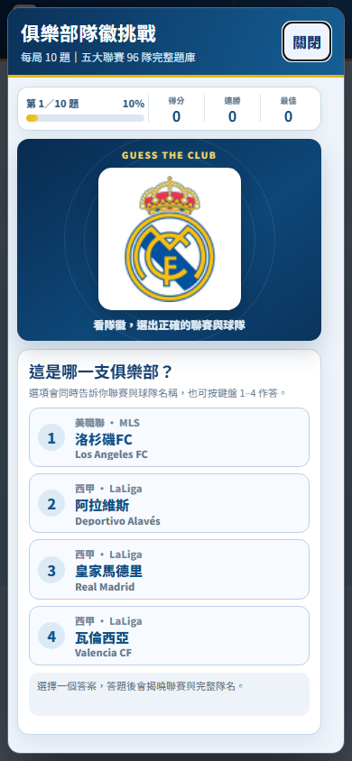
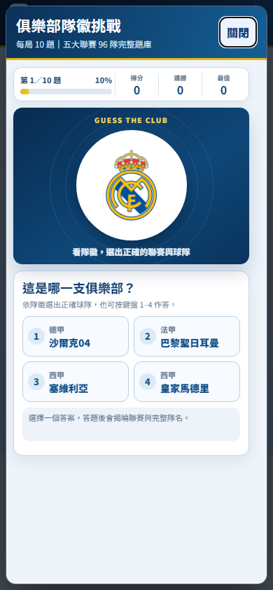
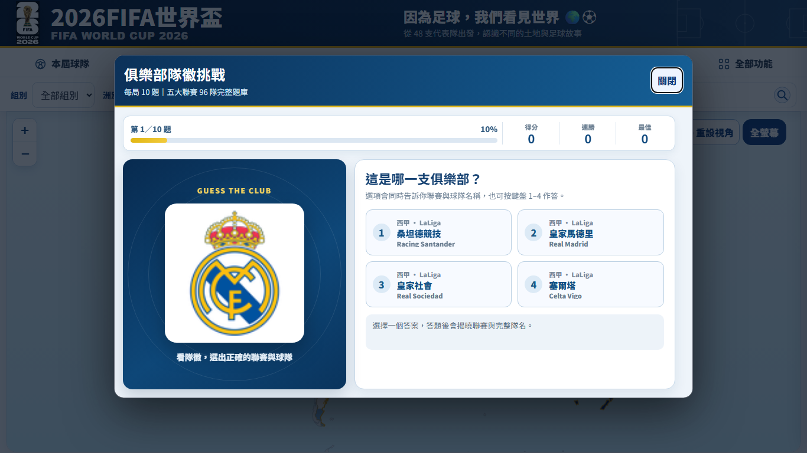
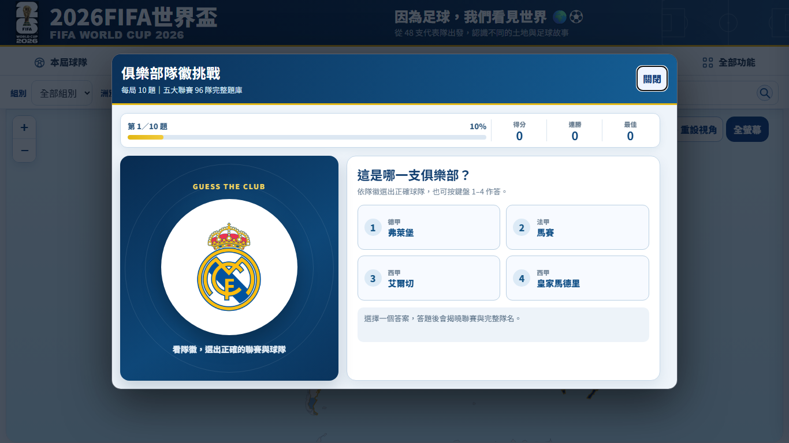
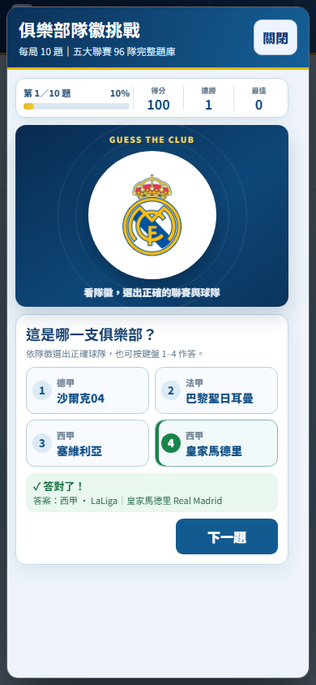

隊徽挑戰的方形白底改為圓形，完整保留隊徽比例；作答選項移除英文聯賽與英文隊名，答題後才揭曉完整名稱。手機四選一改成每列兩個，390×844 可直接看到整題、答題結果與下一題按鈕。

修改 index.html、README.txt、既有遊戲回歸測試與本版驗收素材。題庫、計分及其他功能維持原樣。版本更新為 v2.178。

驗證結果：
- git diff --check 通過。
- 20 份 UTF-8 JSON、5 份球隊 JavaScript、11 段內嵌腳本語法檢查通過。
- HTTP localhost:8000 驗收 1920×1080、1366×768、1024×768、390×844：圓形底框、中文選項、兩欄排列、無水平溢出，下一題按鈕位於視窗內。
- 四種尺寸的瀏覽器主控台無錯誤；Leaflet 使用相同版本本地資源供測試，隊徽使用實際外部資源。
- Playwright v2.178 測試通過：完整題庫、雙欄選項、44px 以上手機觸控範圍、計分、下一題、完成十題、重玩與跨局不重複。
- visual-check.mjs 另外驗證 Escape 關閉與答題前後畫面；量測詳見 after-report.json。

截圖（其餘尺寸同目錄）：

| 尺寸 | 修改前 | 修改後 |
| --- | --- | --- |
| 手機 390×844 |  |  |
| 桌機 1366×768 |  |  |

手機答題後：

限制：較矮視窗或放大文字時仍可使用原有內容捲動。需要回復時可 Revert 本 PR。
